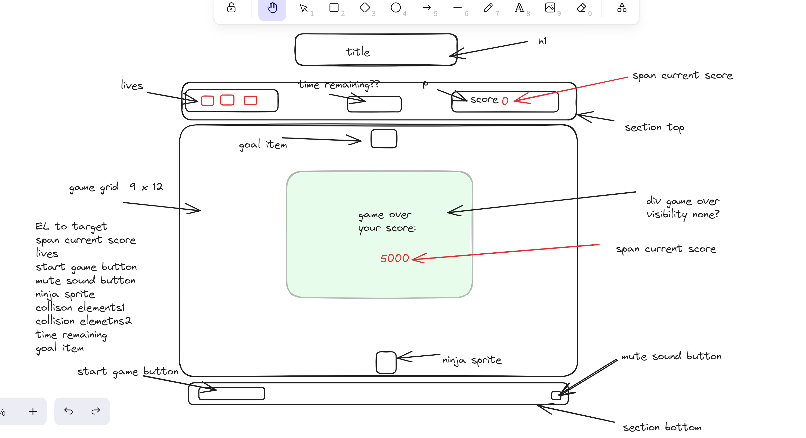
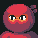
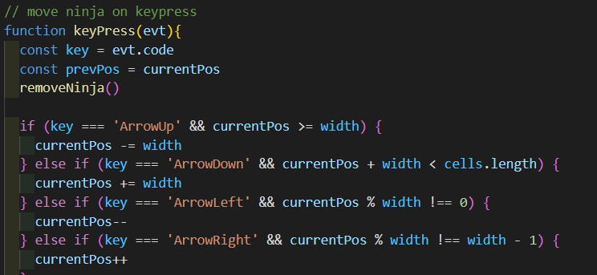
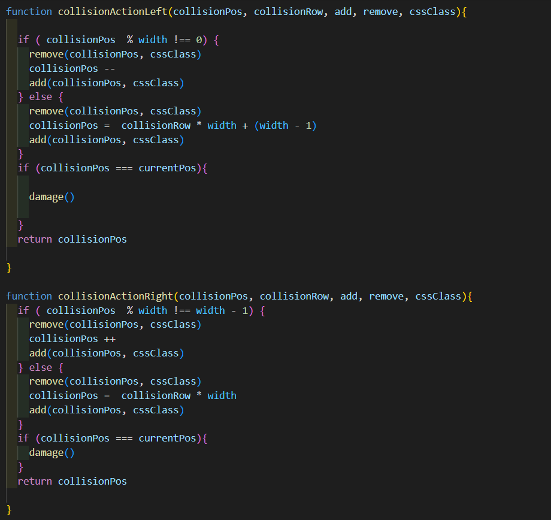
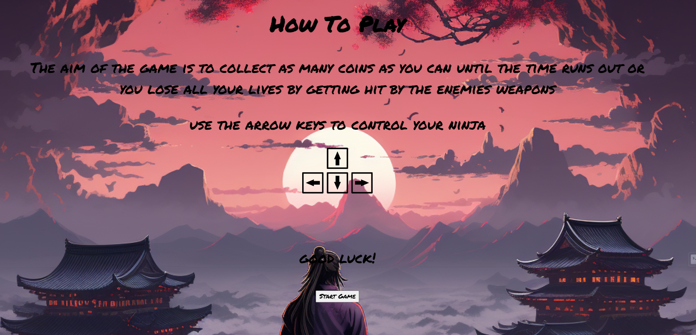

# Ninja-Frogger
My first project
Ninjump ReadMe

# Overview and Concept

This is my first project which is a game called Ninjump! It’s basically Frogger with a ninja theme. The main difference between my project and frogger is u work against the clock to see how many points you can get by collecting the coin that appears in random positions on the first row. This project was created during my fourth week at General Assembly in which we were tasked to choose a game and have it completed by friday morning.

Game’s link:

# Technologies Used

HTML:
Header with logo.
Start screen, gameover overlays with start button and reset button.
Mute button for audio.
Images for character health.
Created grid section

CSS:
Overlay transitions.
Position:  absolute on overlays and display: none to hide them.
Gifs for characters and enemies.
General styling of game.

JavaScript:
Appended grid section to create and push more cells to array.
function  to move the character around the grid.
Play and pause audio.
setInterval to move enemies.
Click events to start and reset the game.
display: none to hide overlays.
Set walls cannot pass through.
Random position generation for the goal Item.

# The approach taken:

Day 1:
I was unsure of what game to choose. I wanted to create my own version of  pacman but as it was my first time I didn't want to bite off more than I could chew. So I opted for a game that was classed as a slightly easier game but would still present some challenge for me which was frogger.

I started with creating a wireframe to give myself a rough indication of what I would have liked my end product to look like while also allowing myself to add improvements along the way. 

I also decided on a theme for my game which was a ninja theme.

Day 2:

The next day I decided to search for assets for me to populate my game with characters or items that suited my chosen theme. I struggled to find something for a while so instead of wasting too much time I chose a ransom picture of a ninja as a placeholder until i found something I would be happy to replace with it.

I then got started on my index.html adding my title and any other text I wanted displayed on the game page. I also created a section for my grid wrapper which I would use to create my 9x13 grid in javascript. Once the grid was complete I created a function to allow my character to be moved around the grid using the arrow keys as you can see below.

Day 3:
On day 3 I decided to get started on my enemies which are called my collisionItems. I started with just one so that I could make sure I was able to get the function done correctly so that the enemy could go from the right of the screen to the left and when it touches the wall it goes back to its start position and using setInterval i managed to get the enemy to continue this action. I then created a damage function to manage your lives when the ninja is hit by or walks into an enemy.

 Once that was done I created a function for my goalItem which is a coin that you need to collect to gain points. Once you collected the coin I used setInterval to have the coin reappear after 3 seconds. At this point I felt it may be better if I added a way for the coin to appear in a random spot within the same row it started on to add some difficulty to the collection of it.

I then went back and added my three other enemies by copying and pasting the existing function. I  changed the  start positions for each one as well as making two of the enemies travel in a different direction left to right.

Day 4:
After day 3 and having so much code for the four enemies I realised I could shorten everything but creating a function for both enemies going left and both enemies going right. This was a win for me as it made things a lot easier for me to read. It did take a while for me to implement this but it helped me a lot. 

The last thing for me to do on day 4 was to add items called rocks with a class of wall that the ninja cannot go through which adds another level of difficulty to the game. I did this by using a For Of loop to add the class wall to a certain position on my grid.

Day 5:
 
Day 5 I used this time to add functionality to my reset button. I also added my game audio and a function to mute the audio when my reset button is pressed. Once this was done I decided to focus on my styling and transitions of my start screen and gameover overlays. I also added a background image to start screen a and a brief how to play. I decided to move my start button to the start screen to improve my UI.

# Key Learnings:
I learned alot about myself during this project. I doubted myself a lot before starting it. I was very proud of myself for managing to implement everything that I wanted to.
I learned how to add overlays and pop up like my start screen and game over display.
Adding and looping audio and resetting the audio without it playing over itself.

# Challenges:
Making my code more dry whilst I made my collision actions function more dry this was a big struggle for me.
Adding a High Score logger .
Animating my ninja I wanted him to look and walk in the direction he was moving. Instead I just opted for a gif. 

# Future improvements:
Maybe add multiple stages .
Multiple ninjas to choose from.
An actual enemy in place so it looks like my collision items are being thrown.

# Bugs:
My game audio wouldn’t play once I uploaded my game to Github .
